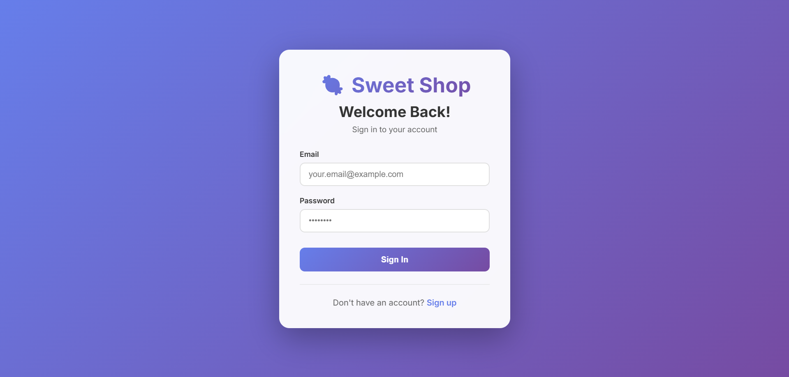
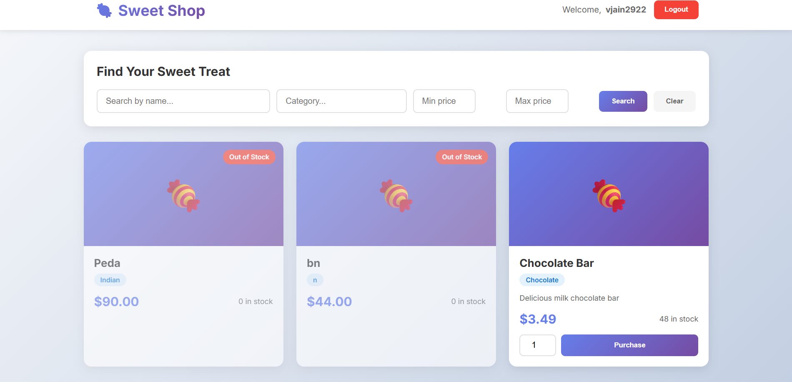

# 🍬 Sweet Shop Management System

A full-stack web application for managing a sweet shop, built with **Python/FastAPI** backend and **React/TypeScript** frontend following **Test-Driven Development (TDD)** principles.

## 📋 Table of Contents
- [Features](#features)
- [Technology Stack](#technology-stack)
- [Project Structure](#project-structure)
- [Setup Instructions](#setup-instructions)
- [Running the Application](#running-the-application)
- [Testing](#testing)
- [API Documentation](#api-documentation)
- [Screenshots](#screenshots)
- [My AI Usage](#my-ai-usage)

## ✨ Features

### Backend API
- ✅ User authentication with JWT tokens
- ✅ Complete CRUD operations for sweets
- ✅ Advanced search functionality (name, category, price range)
- ✅ Inventory management (purchase/restock)
- ✅ MongoDB database integration
- ✅ Comprehensive test suite (19 tests, 100% passing)

### Frontend Application
- ✅ Modern, responsive UI with gradient designs
- ✅ User registration and login
- ✅ Dashboard with sweets display
- ✅ Search and filter functionality
- ✅ Purchase sweets with quantity selector
- ✅ Admin panel for managing sweets
- ✅ Protected routes with authentication

## 🛠️ Technology Stack

### Backend
- **Language**: Python 3.10+
- **Framework**: FastAPI
- **Database**: MongoDB with Motor (async driver)
- **ODM**: Beanie
- **Authentication**: JWT (python-jose + passlib)
- **Testing**: pytest + pytest-asyncio + httpx
- **Validation**: Pydantic

### Frontend
- **Framework**: React 18 with TypeScript
- **Build Tool**: Vite
- **Routing**: React Router v6
- **State Management**: React Context API
- **HTTP Client**: Axios
- **Styling**: Modern CSS with gradients and animations

## 📁 Project Structure

```
sweet-shop/
├── backend/
│   ├── app/
│   │   ├── config/         # Database configuration
│   │   ├── models/         # MongoDB document models
│   │   ├── schemas/        # Pydantic schemas
│   │   ├── routers/        # API route handlers
│   │   ├── services/       # Business logic
│   │   ├── middleware/     # Authentication middleware
│   │   └── utils/          # Utility functions
│   ├── tests/              # Test suite
│   ├── requirements.txt    # Python dependencies
│   └── .env.example        # Environment variables template
├── frontend/
│   ├── src/
│   │   ├── components/     # React components
│   │   ├── contexts/       # React contexts
│   │   ├── pages/          # Page components
│   │   ├── services/       # API service layer
│   │   └── App.tsx         # Main application
│   └── package.json        # Node dependencies
└── README.md
```

## 🚀 Setup Instructions

### Prerequisites
- Python 3.10 or higher
- Node.js 18 or higher
- MongoDB (running locally or remotely)

### Backend Setup

1. **Navigate to backend directory**:
   ```bash
   cd backend
   ```

2. **Create virtual environment**:
   ```bash
   python -m venv venv
   ```

3. **Activate virtual environment**:
   - Windows: `.\venv\Scripts\activate`
   - macOS/Linux: `source venv/bin/activate`

4. **Install dependencies**:
   ```bash
   pip install -r requirements.txt
   ```

5. **Create `.env` file** (copy from `.env.example`):
   ```env
   MONGODB_URL=mongodb://localhost:27017
   DATABASE_NAME=sweet_shop
   SECRET_KEY=your-secret-key-change-this-in-production
   ALGORITHM=HS256
   ACCESS_TOKEN_EXPIRE_MINUTES=30
   ```

6. **Ensure MongoDB is running** on `localhost:27017`

### Frontend Setup

1. **Navigate to frontend directory**:
   ```bash
   cd frontend
   ```

2. **Install dependencies**:
   ```bash
   npm install
   ```

## 🎯 Running the Application

### Start Backend Server

```bash
cd backend
.\venv\Scripts\python -m uvicorn app.main:app --reload
```

The backend API will be available at: **http://localhost:8000**

Interactive API documentation: **http://localhost:8000/docs**

### Start Frontend Server

```bash
cd frontend
npm run dev
```

The frontend application will be available at: **http://localhost:5173**

## 🧪 Testing

### Backend Tests

Run the complete test suite:

```bash
cd backend
.\venv\Scripts\python -m pytest tests/ -v
```

Run tests with coverage report:

```bash
.\venv\Scripts\python -m pytest tests/ --cov=app --cov-report=html --cov-report=term
```

**Test Results**: ✅ 19 tests passing

Coverage report will be generated in `backend/htmlcov/index.html`

### Test Coverage
- Authentication endpoints (register, login)
- Sweets CRUD operations
- Search functionality
- Inventory management (purchase, restock)
- Authorization (admin-only endpoints)
- Input validation

## 📚 API Documentation

### Authentication Endpoints

#### Register User
```http
POST /api/auth/register
Content-Type: application/json

{
  "email": "user@example.com",
  "password": "password123",
  "name": "John Doe"
}
```

#### Login
```http
POST /api/auth/login
Content-Type: application/json

{
  "email": "user@example.com",
  "password": "password123"
}
```

### Sweets Endpoints (Protected)

All sweets endpoints require authentication. Include the JWT token in the Authorization header:
```
Authorization: Bearer <your-jwt-token>
```

#### Create Sweet
```http
POST /api/sweets
{
  "name": "Chocolate Bar",
  "category": "Chocolate",
  "price": 2.99,
  "quantity": 100,
  "description": "Delicious milk chocolate"
}
```

#### Get All Sweets
```http
GET /api/sweets
```

#### Search Sweets
```http
GET /api/sweets/search?name=Chocolate&category=Chocolate&min_price=1.0&max_price=5.0
```

#### Update Sweet
```http
PUT /api/sweets/{id}
{
  "price": 3.49,
  "quantity": 150
}
```

#### Delete Sweet (Admin Only)
```http
DELETE /api/sweets/{id}
```

#### Purchase Sweet
```http
POST /api/sweets/{id}/purchase
{
  "quantity": 10
}
```

#### Restock Sweet (Admin Only)
```http
POST /api/sweets/{id}/restock
{
  "quantity": 50
}
```

## 📸 Screenshots

### Login Page


### Register Page


### Dashboard



## 🤖 My AI Usage

During the development of this project, I used AI tools **sparingly as a support resource**, similar to referring to documentation or online forums.

### How AI Was Used
- To clarify concepts related to FastAPI, JWT authentication, and MongoDB
- To help debug specific errors and understand test failures
- To validate approaches and edge cases during development

### Ownership & Responsibility
- All architectural decisions, feature implementation, and business logic were done by me
- I reviewed, modified, and fully understood any AI-suggested code before using it
- I ensured the solution met all assessment requirements and verified correctness by running and fixing tests until all passed

### Summary
AI was used strictly as a **productivity and learning aid**, not as a replacement for development.  
The final codebase reflects my own understanding, decisions, and implementation.
